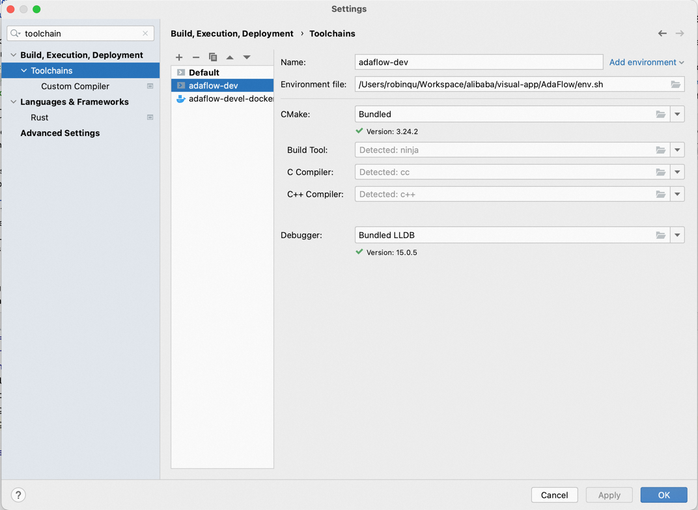
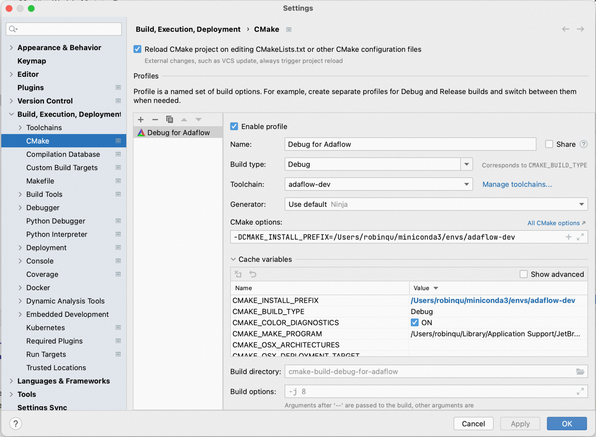

# Jetbrains CLion IDE setup

CLion has built-in support for Python and C++/C development, so it's a reasonable choice for AdaFlow development. Following instructions below, you will be guided to setup CLion with AdaFlow project.

Glossary:

* `System toolchain`: Configure and build in host system. Cmake profiles may be affected by existing environments.
* `Docker toolchian`: Configure and build in a docker container. Your build will be performed in an isolated container, which is running `XStremear development image`.

Pre-requisites

* CLion **2022.3.2** or above
* CMake **3.25.2** or above
* Conda **23.1.0** or above

## Option 1: System toolchain setup

### Create python env

It's still a must to create Conda env `adaflow-dev` with necessary dependencies. Refer to [Building from source](./build_from_source.md) for detailed instructions.

### Create a Toolchain 

Add plus icon to create a new toolchain configuration in Clion setup.

* Click `Add Environment` link text , and select `From file` in the dropdown select;
* Fill in full path to [env.sh](../../env.sh) of project root in the `Envronment File` input;
* Keep default for other options in dialog.

### Create Cmake Profile

Create Debug and Release Cmake Profile in Clion settings:

* Choose `adaflow-dev` in toolchain select
* In CMake options input, set `CMAKE_INSTALL_PREFIX` to the value of `$CONDA_PREFIX` of `adaflow-dev`.
* Remains default for other options in dialog

### Reload and build

* Select `File` -> `Reload CMake Project` in menu to trigger CMake configure.
* Select `Build` -> `Rebuild Project` in menu to trigger a fresh build.

## Option2: Docker toolchain setup

TODO

### FAQ

TODO