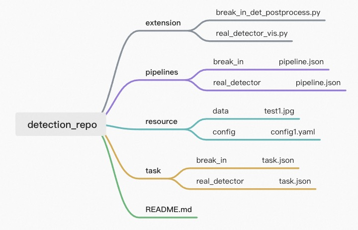

# AdaFlow Command Line Tool

## adaflow launch
### Name
`adaflow launch` - build and run an adaflow pipeline

### Synopsis
```bash
adaflow launch [repo_path] [pipeline_name] [task-description]
```

### Description
`adaflow launch` - build and run adaflow pipelines which exist in structured pipeline repository  
`[repo_path]` - path of the repository to launch  
`[pipeline_name]` - name of the pipeline to load  
`[task-description]` - option 1: `--task_path` JSON path of task-description which includes input and output information.
option 2: `--task` dict of task-description command line 

### Sample
build and run real detector pipeline in the detection_repo which named real_detector, the detection results visualization
on the video

  

- run with `--task_path`
```bash
adaflow launch detection_repo real_detector --task_path ./detection_repo/task/real_detector/task.json 
```
  
- run with `--task`
```bash
launch detection_repo real_detector --task '{"sources": [{"name": "src1", "type": "file", "location": "./detection_repo/resource/data/MOT17-03-partial.mp4"}], "sinks": [{ "name": "sink1", "type": "file", "location": "./detection_repo/resource/data/MOT17-03-partial_detector_vis.mp4"}]}' 
```
- detection results visualization  
result save in the images/MOT17-03-partial_detector_vis.gif

## adaflow init

### Name
`adaflow init` - init and create standard pipeline repository

### Synopsis
```bash
adaflow init [repo_name] [pipeline]
```

### Description
`adaflow init` - init and create standard pipeline repository  
`[repo_name]` - name of the repository to init 
`[pipeline]` - name of the pipeline to init

### Sample
init and create standard pipeline repository named `test_repo` include pipline `testpipeline`
```bash
adaflow init test_repo --task testpipeline
```