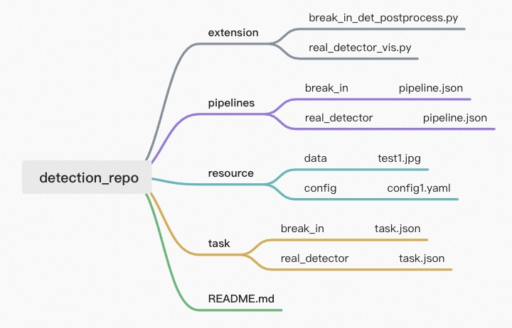

# Concept


|               | JSON Schema                                    | Description                                                                               |
|---------------|------------------------------------------------|-------------------------------------------------------------------------------------------|
| pipeline.json | [pipeline_schema.json](./pipeline_schema.json) | Definition of a reusable pipeline.                                                        |
| task.json     | [task_schema.json](./task_schema.json)         | Defintion of ad-hoc request for a pre-defined pipeline and desination of pipeline result. |


## IO abstraction

*  A pipeline should always have at least one source and one destination.
*  on-screen display will cause problem in serving situation.

## Source object

|             | Converted GST element    | Description                                                    |
|-------------|--------------------------|----------------------------------------------------------------|
| URI         | urisourcebin ! decodebin | Download a remote file, decode, and covnert with given filter. |
| Local file  | filesource ! decodebin   | Read a local file, decode, and covnert with given filter.      |
| RTSP        | urisourcebin ! decodebin | Consume a RTSP stream, and convert with given filter           |
| Camera      | v4l2src                  | Consume a web camera stream, with given filter                 |
| Application | appsrc                   | Programmable interface to push data into pipeline              |

Common options for source object:
* `filter`: will be applied after source element as GStremaer cspfilter ! videoconvert ! videoscale  element
* `properties`: will be applied for the converted GStreamer source element.

Examples:

```text
{{F.adaptive_source('src1')}} ! mass_model task=domain-specific-object-detection id = damo/cv_tinynas_human-detection_damoyolo ! mass_model_post input=./data/break_in_count_deploy.yaml module=./test_pipelines/extensions/break_in_det_postprocess.py ! videoconvert ! appsink name=sink1
```

## Destination object

|                 | converted GST element       | Description                                                                                   |
|-----------------|-----------------------------|-----------------------------------------------------------------------------------------------|
| Application     | appsink                     | `AVDataPacket` stream will be sent to Pipeline consumer API ( like  Pipeline#pop(src_name) ). |
| Metadata export | flow_metadata_sink          | Dump metadata to external destination like json file or message queue.                        |
| OSS upload      | flow_oss_upload_sink        | A data sink for storage in Aliyun Object Storage Service.                                     |
| Others          | Other existing Gst elements | Generate an gst element and configure.                                                        |


Examples:

```text
{{F.source('src1')}} ! decodebin ! videoconvert ! videoscale ! video/x-raw,format=RGB ! mass_model task=domain-specific-object-detection id = damo/cv_tinynas_human-detection_damoyolo ! mass_model_post input=./data/break_in_count_deploy.yaml module=./test_pipelines/extensions/break_in_det_postprocess.py ! videoconvert ! {{F.sink('sink1')}}
```

## Pipeline Parameters

### Define parameter schema in `pipeline.json`

```json
{
	"name": "...",
  "backend": "GStreamer",
  "dialect": "{{F.source('src1')}} ! decodebin ! videoconvert ! videoscale ! video/x-raw,format=RGB ! mass_model task=domain-specific-object-detection id = damo/cv_tinynas_human-detection_damoyolo ! mass_model_post input={{paramters.foo}} module=./test_pipelines/extensions/break_in_det_postprocess.py ! videoconvert ! {{F.sink('sink1')}}",
  "parameters": {
    "type": "object",
    "properties": {
    	"foo": {
        "type": "string",
        "default": "aaa"
      },
      "bar": {
      	"type": "integer"
        "default": "{{env.BAR}}"
      },
      "jar": {
        "type": "string",
        "x-adaflow-parameter-target": {
          "name": "element1",
          "property": "prop1"
        },
        "default": "aaaa"
      }
      
    }
  }
}
```

* default value resolution
  * from env variables: `{{env.BAR}}`
  * as static value
* parameter for element properties, x-element-target
  * name: the name of pipeline element to apply
  * property: the name of element property to apply
* template value substitution using `{{parameters.name}}`

### Define Parameters in `task.json`


```json
{
	"sources":  [],
  "sinks": [],
  "paramters": {
      "foo": "aaaa",
      "bar": 123,
      "jar": "bbb"
  }
}
```


## Pipeline Repository




