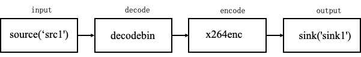

English | [简体中文](basic_tutorial_1.md)
# Basic Tutorial 1:compose and run the first pipeline

AdaFlow usually only takes three steps to compose a new pipeline, and only one line of command is needed to run this pipeline

## Composing pipeline
### 1. Create local folder as pipeline repository

AdaFlow provides command line tools, the `adaflow init` command is quite straight forward for repository initialization.

```shell
# to create a repository named `my_pipelines` and an empty pipeline definition for a pipeline named `foobar`.  
adaflow init my_pipelines --pipeline foobar
```

### 2. Create `pipeline.json` for pipeline definitions

Then modify `my_pipelines/pipelines/foobar/pipeline.json` with actual pipeline definition,
this example implements the process of decoding a mp4 video and then encoding it into a new mp4 video. 
The specific definitions are as follows:




```
{
  "name": "foobar",
  "backend": "GStreamer",
  "dialect": [
    "{{F.source('src1')}}",
    "decodebin",
    "x264enc",
    "mp4mux",
    "{{F.sink('sink1')}}"
  ]
}
```
* `name` field is the unique pipeline name inside this repository.
* `backend` is the identifier for different processing backend. `GStreamer` is chosen here.
* `dialect` is the description of processing pipeline.
  * elements wrapped in ``{{`` and ```}}``` are runtime resolved elements. It will be dynamically compiled according to task requests. `F.source` and `F.sink` are placeholder function for source elements and sink elements.
  * `decodebin` element is used for video decoding
  * `x264enc` element is used for X264 video encoding.
  * `mp4mux` element is used to re-mux frames into MP4 format.

### 3. Write extensions to complete your tasks if necessary.
This example does not need to do other postprocess in the pipeline, so this step is not required, 
and all operations of creating a pipeline repository are completed.

## run pipeline

Finally, to launch an ad-hoc execution for this pipeline:

```shell
adaflow launch my_pipelines foobar --task `{"sources": [{"name": "src1", "type": "file", "location": "file.mp4"}], "sinks": [{"name": "sink1", "type": "gst", "element": "filesink", "properties": {"location": "output.mp4"}}]}`
```

* we pass the actual task data using `--task` parameter, which accepts JSON string.
* In the task data:
  * a single file source is assigned with input from `file.mp4`
  * a single file sink is assigned, whose output is written to `output.mp4`.

To put it simple, it will decode a local file stored in `file.mp4` and then encode frames using X264 and then re-mux into a new MP4 file in `output.mp4`. In this example, no model related actions is taken, but it's a proper demonstration about IO abstraction and pipeline execution. To learn more about it, please refer to [Concept](./concept.md).

> **The end of chapter, thank you for reading**