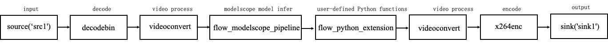

English | [简体中文](basic_tutorial_2.md)
# Basic Tutorial 2:compose a simple single model pipeline

This tutorial mainly uses the detection solutions as an example to explain how to build a single model pipeline,
the task is object detection with visualization.

## Composing pipeline
### 1. Create local folder as pipeline repository
Create the `detection_repo` repository, the folder of the task is `real_detector`.
```shell
cd ./modules/adaflow-python/test/

adaflow init detection_repo --pipeline real_detector
```

### 2. Create `pipeline.json` for pipeline definitions

Then modify `detection_repo/pipelines/real_detector/pipeline.json` with actual pipeline definition,



```
{
    "name": "real_detector",
    "description": "visualization after realtime detector",
    "backend": "GStreamer",
    "dialect": [
      "{{F.source('src1')}}",
      "videoconvert",
      "videoscale",
      "video/x-raw,format=RGB",
      "flow_modelscope_pipeline task=image-object-detection id = damo/cv_cspnet_image-object-detection_yolox meta-key=detection",
      "flow_python_extension input=./detection_repo/resource/config/real_detector.yaml module=./detection_repo/extension/real_detector_vis.py class= RealDetectorPost function= postprocess",
      "videoconvert",
      "videoscale",
      "video/x-raw,format=I420",
      "x264enc qp-max=15",
      "mp4mux",
      "{{F.sink('sink1')}}"
    ]
  }
```

* `name` field is the unique pipeline name inside this repository.
* `backend` is the identifier for different processing backend. `GStreamer` is chosen here.
* `dialect` is the description of processing pipeline.
    * elements wrapped in ``{{`` and ```}}``` are runtime resolved elements. It will be dynamically compiled according to task requests. `F.source` and `F.sink` are placeholder function for source elements and sink elements.
    * `videoconvert`convert video frames between multiple video formats, usually used with `videoscale`.
    * `videoscale` `video/x-raw,format=RGB`element for video scale、color format..., `format=RGB` convert the video frame to RGB color space and pass it to the model inference.
    * `flow_modelscope_pipeline` element is to model inference form modelscope according to `task` and `id`, `meta-key=detection` set the transfer of the detection result of the model and the keyword for the downstream node to obtain the result is `detection`
    * `flow_python_extension` element provides a callback to execute user-defined Python functions on every frame in the
      adaflow pipeline, and can be used for metadata conversion, inference post-processing, and other tasks. `input`parameters of user-defined functions file path(such as yaml file),
      `module` Python module name, usually a python file path, `class`(optional) Python class name, `function` Python function name(Default, postprocess).
    * `videoconvert` `videoscale` `video/x-raw,format=I420`convert video to `format=I420`for save or use.
    * `x264enc` element is used for X264 video encoding, the parameter `qp-max=15` specifies that the maximum `qp` in the encoding process is 15, the smaller `qp-max`, the smaller the compression, and the better the video quality.
    * `mp4mux` element is used to re-mux frames into MP4 format.


### 3. Write extensions to complete your tasks if necessary

`flow_python_extension` element provides a callback to execute user-defined Python functions on every frame in the
adaflow pipeline, take the object detection with visualization as an example to explain the specific usage method.
First create a custom post-processing python file `detection_repo/extension/real_detector_vis.py`：

```bash
from adaflow.av.data.av_data_packet import AVDataPacket
```
import adaflow api `AVDataPacket`, this class represents video frames - working with metadata which
belong to this video frame (image). Metadata describes inference results on VideoFrame level.
VideoFrame also provides access to underlying GstBuffer and GstVideoInfo describing frame's video information (such
as image width, height, channels, strides, etc.).

```bash
import cv2
...
```
import libraries for additional dependencies of your own functions.

```bash
class RealDetectorPost:
    def postprocess(self, frames: AVDataPacket, kwargs):
```
define Python class name and Python function name, and the function parameters are the frames(class AVDataPacket) and
kwargs(user-defined parameters which parsed by element flow_python_extension).

```bash
color:
  [255, 0, 0]
```
The code to get this parameter in the function:
```bash
self.color = kwargs['color']
```
the color value of the resulting box and the content of yaml file(real_detector.yaml) which defined by user.

```bash
for frame in frames:
```
per frame process.

```bash
self.meta_data = frame.get_json_meta('detection')
self.image = frame.data()
scores = self.meta_data['scores']
boxes = self.meta_data['boxes']
labels = self.meta_data['labels']
```
get inference results and frame information, and the meta name `detection` is set by user in the previous plugin
`flow_modelscope_pipeline` as key `meta-key=detection`.

```bash
for idx in range(len(scores)):
    x1, y1, x2, y2 = boxes[idx]
    score = str(scores[idx])
    label = str(labels[idx])
    cv2.rectangle(self.image, (int(x1), int(y1)), (int(x2), int(y2)), self.color, 2)
    cv2.putText(self.image, label, (int(x1), int(y1) - 10),
    cv2.FONT_HERSHEY_PLAIN, 1, self.color)
    cv2.putText(self.image, score, (int(x1), int(y2) + 10),
    cv2.FONT_HERSHEY_PLAIN, 1, self.color)
```
user-defined functions：inference results show on the image, draw rectangles and put labels.

## Run pipeline

Finally, use AdaFlow's command-line tool `adaflow launch` to start the pipeline, and the input and output of the video source to be processed are specified by the user.

- method 1： set by detection_repo/task/real_detector/task.json 
```bash
{
  "sources": [{"name": "src1", "type": "file", "location": "./detection_repo/resource/data/MOT17-03-partial.mp4"}],
  "sinks": [{ "name": "sink1", "type": "file", "location": "./detection_repo/resource/data/MOT17-03-partial_detector_vis.mp4"}]
}
```
input video：./detection_repo/resource/data/MOT17-03-partial.mp4  
output video：./detection_repo/resource/data/MOT17-03-partial_detector_vis.mp4

run pipeline:

```bash
adaflow launch detection_repo real_detector --task_path ./detection_repo/task/real_detector/task.json 
```

- method 2：JSON string to set the actual input and output video file information of the task
```bash
adaflow launch detection_repo real_detector --task '{"sources": [{"name": "src1", "type": "file", "location": "./detection_repo/resource/data/MOT17-03-partial.mp4"}], "sinks": [{ "name": "sink1", "type": "file", "location": "./detection_repo/resource/data/MOT17-03-partial_detector_vis.mp4"}]}' 
```

> **The end of chapter, thank you for reading**


