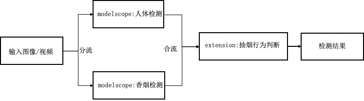
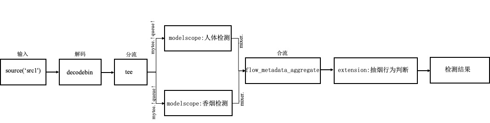

[English](basic_tutorial_3_EN.md) | 简体中文
# 基础教程3:多模型并联pipeline搭建
本教程主要以检测套件为例讲解如何搭建多模型并联pipeline, 具体任务是抽烟检测场景，整个pipeline包含人体检测、香烟检测和抽烟判断模块实现抽烟行为检测。



## 创建pipeline
### 1.创建本地pipeline仓库
基础教程2已经创建`detection_repo`仓库，此步骤跳过

### 2.创建pipeline描述文件`pipeline.json`

根据通用目标检测的pipeline的任务填写`detection_repo/pipelines/smoke_det/pipeline.json`文件：



```
{
    "name": "smoke_detection",
    "description": "smoke detection post process",
    "backend": "GStreamer",
    "dialect": "{{F.source('src1')}} ! videoconvert ! videoscale ! video/x-raw,format=RGB ! 
    tee name=mytee mytee. ! queue ! 
    flow_modelscope_pipeline task=domain-specific-object-detection id = damo/cv_tinynas_human-detection_damoyolo meta-key=human ! 
    flow_metadata_aggregate name = mixer ! 
    flow_python_extension input=./detection_repo/resource/config/smoke_det_deploy.yaml module=./detection_repo/extension/smoke_det_postprocess.py class= SmokeDetPostprocess ! 
    videoconvert ! videoscale ! jpegenc ! {{F.sink('sink1')}}  
    mytee. ! queue ! flow_modelscope_pipeline task=domain-specific-object-detection id = damo/cv_tinynas_object-detection_damoyolo_cigarette meta-key=cigare ! mixer."
}
```

本教程主要讲解如何使用gstreamer插件实现视频/图片的分流与合流。
* `dialect` 是pipeline处理的具体描述，可以像基础教程1/2单个节点双引号描述，也可以像本教程一个双引号描述，节点间的连接使用`！`。
    * `tee name=mytee mytee. ! queue ! `将视频/图片以`tee`在前一个节点的处理后分流，名字`mytee`，使用`mytee. ! queue !`可多次复制一路视频/图片流送入下一个节点
    * `flow_metadata_aggregate` 接收多路推理结果的合流，前一个节点默认作为第一路流送入`aggregate`，该合流插件名`mixer`, 其他推理插件后跟`mixer.`也会送入合流插件
    * `jpegenc`jpg图片编码插件

### 3.编写扩展代码完成任务的其他操作
AdaFlow提供插件`flow_python_extension`调用用户自定义的后处理函数，本例子在两个模型推理结束后，需要抽烟判断模块实现最终地抽烟行为检测，
抽烟判断模块使用extension实现，完整代码在detection_repo/extension/smoke_det_postprocess.py中

```bash
human_det_res = frame.get_json_meta('human')
cigs_det_res = frame.get_json_meta('cigare')
self.image = frame.data()
smoke_det_res = self._smoke_det(human_det_res, cigs_det_res)
```
其中核心一段代码，分别获取人体检测和香烟检测结果，送入抽烟判断函数做最终处理。

## 运行pipeline

最后使用AdaFlow的命令行工具`adaflow launch`启动pipeline，具体处理的视频源的输入和输出由用户指定。   
使用方式1：通过detection_repo/task/smoke_det/task.json设置
```bash
{
  "sources": [{"name": "src1", "type": "file", "location": "./detection_repo/resource/data/smoke_a388.jpg"}],
  "sinks": [{ "name": "sink1", "type": "file", "location": "./detection_repo/resource/data/smoke_a388_det.jpg"}]
}
```

运行整个pipeline:

```bash
adaflow launch detection_repo smoke_det --task_path ./detection_repo/task/smoke_det/task.json 
```

> **本章结束，感谢阅览**


