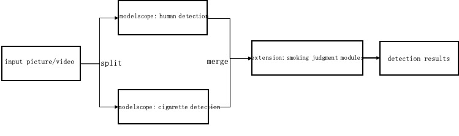
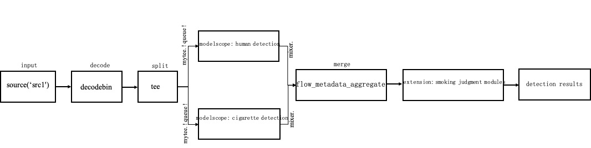

English| [简体中文](basic_tutorial_3.md)
# Basic Tutorial 3:compose a multi-model parallel pipeline
This tutorial mainly uses the detection solutions as an example to explain how to build a multi-model parallel pipeline,
The specific task is the smoking detection scene, the entire pipeline includes human detection, cigarette detection and smoking judgment modules to realize smoking behavior detection.



## Composing pipeline
### 1. Create local folder as pipeline repository
The `detection_repo` repository has been created in Basic Tutorial 2, this step is skipped.

### 2. Create `pipeline.json` for pipeline definitions
Then modify `detection_repo/pipelines/smoke_det/pipeline.json` with actual pipeline definition,



```
{
    "name": "smoke_detection",
    "description": "smoke detection post process",
    "backend": "GStreamer",
    "dialect": "{{F.source('src1')}} ! videoconvert ! videoscale ! video/x-raw,format=RGB ! 
    tee name=mytee mytee. ! queue ! 
    flow_modelscope_pipeline task=domain-specific-object-detection id = damo/cv_tinynas_human-detection_damoyolo meta-key=human ! 
    flow_metadata_aggregate name = mixer ! 
    flow_python_extension input=./detection_repo/resource/config/smoke_det_deploy.yaml module=./detection_repo/extension/smoke_det_postprocess.py class= SmokeDetPostprocess ! 
    videoconvert ! videoscale ! jpegenc ! {{F.sink('sink1')}}  
    mytee. ! queue ! flow_modelscope_pipeline task=domain-specific-object-detection id = damo/cv_tinynas_object-detection_damoyolo_cigarette meta-key=cigare ! mixer."
}
```

This tutorial mainly explains how to use the gstreamer plugins to realize video/picture splitting and merging.
* `dialect` a specific description of pipeline processing, it can be described in double quotes like the basic tutorial 1/2 for a single node, or it can be described in double quotes like this tutorial, and the connection between nodes uses `! `.
  * `tee name=mytee mytee. ! queue ! ` split the video/picture with `tee` after the processing of the previous node, named`mytee`, using `mytee. ! queue !` to copy a video/picture stream multiple times and send it to the next node.
  * `flow_metadata_aggregate` receive a concatenation of multiple inference results, the previous node is sent to `aggregate` as the first stream by default. The name of the confluence plugin is `mixer`, and other reasoning plugin followed by `mixer.` will also be sent to the confluence plugin.
  * `jpegenc` element for jpg picture encoder.

### 3.Write extensions to complete your tasks if necessary

In this example, after the results of the two models inference, the smoking judgment module is required to realize the final smoking behavior detection.
The smoking judgment module is implemented using extension, full code in detection_repo/extension/smoke_det_postprocess.py.

```bash
human_det_res = frame.get_json_meta('human')
cigs_det_res = frame.get_json_meta('cigare')
self.image = frame.data()
smoke_det_res = self._smoke_det(human_det_res, cigs_det_res)
```
The core piece of code obtains the human body detection and cigarette detection results respectively, and sends them to the smoking judgment function for final processing.

## run pipeline

Finally, use AdaFlow's command-line tool `adaflow launch` to start the pipeline, and the input and output of the video source to be processed are specified by the user.

method 1：set by detection_repo/task/smoke_det/task.json
```bash
{
  "sources": [{"name": "src1", "type": "file", "location": "./detection_repo/resource/data/smoke_a388.jpg"}],
  "sinks": [{ "name": "sink1", "type": "file", "location": "./detection_repo/resource/data/smoke_a388_det.jpg"}]
}
```

run pipeline:

```bash
adaflow launch detection_repo smoke_det --task_path ./detection_repo/task/smoke_det/task.json 
```

> **The end of chapter, thank you for reading**


