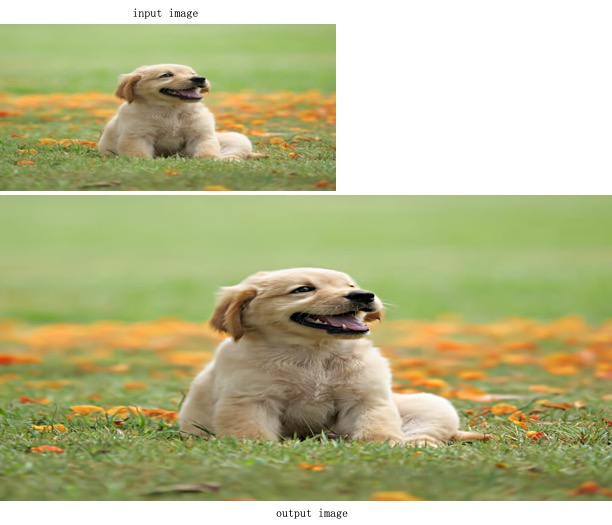
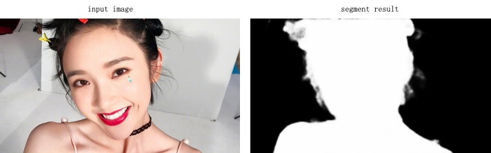
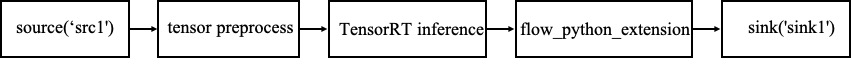
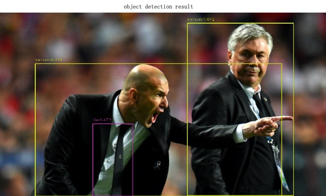
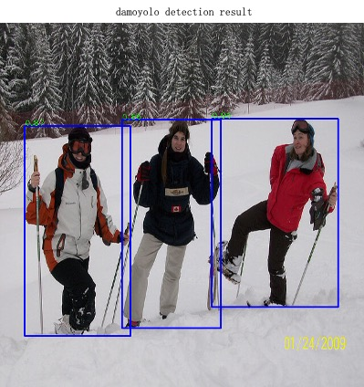

[English](basic_tutorial_4_EN.md) | 简体中文
# 基础教程4:TensorRT模型部署
本教程主要介绍如何使用TensorRT插件搭建pipeline, 主要包含[超分模型](#超分模型)、[人像分割模型](#人像分割模型)、[物体检测模型](#物体检测模型)，这些模型都已经转换为ONNX。
( ⚠️初次运行pipeline，会根据实际运行硬件，将onnx转换为trt格式，有一定耗时，后续运行将会直接使用已经存在的trt模型。)

## 创建本地pipeline仓库
可参考基础教程1创建一个新的仓库`onnx_model_repo`

## <a id="超分模型">超分模型</a>
### 创建pipeline描述文件`pipeline.json`

根据超分模型的pipeline的任务填写`onnx_model_repo/pipelines/SR/pipeline.json`文件：

```
{
  "name": "SR",
  "description": "video super resolution based on TensorRT",
  "backend": "TensorRT",
  "dialect": "{{F.source('src1')}} ! videoconvert ! videoscale ! 
   video/x-raw,height=360,width=720,format=RGB ! flow_tensor_convert ! 
   flow_tensor_transform way=arithmetic option=div:255.0 ! 
   flow_tensor_transform way=dimchg option=nchw ! 
   flow_trtinfer onnx=./onnx_model_repo/resource/models/SR_sample.onnx trt=./onnx_model_repo/resource/models/SR_sample.trt sr=2 flexible=1 ! 
   flow_tensor_transform way=dimchg option=nhwc ! 
   flow_tensor_transform way=arithmetic option=mul:255.0 ! 
   flow_tensor_transform way=clamp option=0:255 ! flow_tensor_decode ! 
   videoconvert ! jpegenc ! {{F.sink('sink1')}}"
}
```

* `dialect` 是pipeline处理的具体描述，可以像基础教程1/2单个节点双引号描述，也可以像本教程一个双引号描述，节点间的连接使用`！`。
  * `flow_tensor_convert` 将图像/视频帧转换为推理需要的`tensor`数据，默认`float32`
  * `flow_tensor_transform` `tensor`数据的处理，当`way=arithmetic`，包含`add`-加法，`div`-除法，`mul`-乘法。
    当`way=dimchg`，数据维度转换，排布可以设置为`nchw`或者`nhwc`。当`way=clamp`，数据截断，可通过`option`设置上下限。
  * `flow_trtinfer` `TensorRT`推理后端的`AdaFlow`插件，`onnx`指定模型地址，`trt`生成`trt-model`的地址，执行一次，如果`trt`模型已经存在，会自动跳过`onnx转trt`，
    `sr`输出图像超分倍数， `flexible`模型是否为可变`shape`。
  * `flow_tensor_decode` `tensor`数据转换回图像/视频帧。

### 运行pipeline
运行整个pipeline:

```bash
adaflow launch onnx_model_repo SR --task_path ./onnx_model_repo/task/SR/task.json 
```

### pipeline结果


## <a id="人像分割模型">人像分割模型</a>
### 创建pipeline描述文件`pipeline.json`

根据人像分割模型的pipeline的任务填写`onnx_model_repo/pipelines/segment/pipeline.json`文件：

```
{
  "name": "segment",
  "description": "human segment based on TensorRT",
  "backend": "TensorRT",
  "dialect": "{{F.source('src1')}} ! videoconvert ! videoscale ! 
  video/x-raw,width=320,height=176,format=RGB ! flow_tensor_convert ! 
  flow_tensor_transform way=dimchg option=nchw ! 
  flow_trtinfer onnx =./onnx_model_repo/resource/models/segment_sample.onnx trt=./onnx_model_repo/resource/models/segment_sample.trt ! 
  flow_tensor_transform way=arithmetic option=mul:255 ! flow_tensor_resize width=1024 height=576 ! 
  flow_tensor_decode ! videoconvert ! jpegenc ! {{F.sink('sink1')}}"
}
```

### 运行pipeline
运行整个pipeline:

```bash
adaflow launch onnx_model_repo segment --task_path ./onnx_model_repo/task/segment/task.json 
```

### pipeline结果


## <a id="物体检测模型">物体检测模型</a>

### 创建pipeline描述文件`pipeline.json`



- 检测模型：yolov8s

根据物体检测模型的pipeline的任务填写`onnx_model_repo/pipelines/detection/pipeline.json`文件：

```
{
  "name": "object detection",
  "description": "object detection based on TensorRT",
  "backend": "TensorRT",
  "dialect": "{{F.source('src1')}} ! videoconvert ! videoscale ! 
  video/x-raw,width=640,height=640,format=RGB ! flow_tensor_convert ! 
  flow_tensor_transform way=arithmetic option=div:255.0 ! flow_tensor_transform way=dimchg option=nchw ! 
  flow_trtinfer onnx=./onnx_model_repo/resource/models/yolov8s.onnx trt=./onnx_model_repo/resource/models/yolov8s.trt input-name=input add-meta=true meta-key=det ! 
  flow_tensor_transform way=arithmetic option=mul:255.0 ! flow_tensor_transform way=dimchg option=nhwc ! 
  flow_tensor_resize width=1280 height=720 ! flow_tensor_decode ! 
  flow_python_extension module=./onnx_model_repo/extension/obj_detection_postprocess.py class= ObjDetPost function= postprocess ! 
  videoconvert ! jpegenc ! {{F.sink('sink1')}}"
}
```

* `dialect` 是物体检测pipeline处理的具体描述
  * `flow_tensor_convert` 将图像/视频帧转换为推理需要的`tensor`数据，默认`float32`
  * `flow_trtinfer` `TensorRT`推理后端的`AdaFlow`插件，`onnx`指定模型地址，`trt`生成`trt-model`的地址，执行一次，如果`trt`模型已经存在，会自动跳过`onnx转trt`，
    `input-name` onnx模型输入的名字，默认`input`，`add-meta`需要将推理结果保存为`JSONMETA`附属在`GstBuffer`上，建议在检测识别类任务上使用，
    `meta-key` `JSONMETA`数据的key，下游插件可通过key获取该推理结果。
  * `flow_python_extension`对TensorRT模型的推理结果做自定义的PYTHON后处理，`input`设置后处理的外置参数文件，`module`自定义python后处理
    函数py文件所在的位置，`class`函数类名，`function`具体函数实现名，具体`obj_detection_postprocess.py`内容会在下面介绍。


- 检测模型：damoyolo    
根据物体检测模型的pipeline的任务填写`onnx_model_repo/pipelines/detection/pipeline.json`文件：

```
{
  "name": "damoyolo object detection",
  "description": "object detection based on TensorRT",
  "backend": "TensorRT",
  "dialect": "{{F.source('src1')}} ! videoconvert ! videoscale ! 
  video/x-raw,width=640,height=640,format=RGB ! flow_tensor_convert ! 
  flow_tensor_transform way=dimchg option=nchw ! 
  flow_trtinfer onnx=./onnx_model_repo/resource/models/damoyolo_object_det.onnx trt=./onnx_model_repo/resource/models/damoyolo_object_det.trt input-name=images add-meta=true meta-key=det ! 
  flow_tensor_transform way=dimchg option=nhwc ! flow_tensor_decode ! 
  flow_python_extension module=./onnx_model_repo/extension/damoyolo_postprocess.py class= ObjDetPost function= postprocess ! 
  videoconvert ! jpegenc ! {{F.sink('sink1')}}"
}
```

* `dialect` 是物体检测pipeline处理的具体描述
  * `flow_tensor_convert` 将图像/视频帧转换为推理需要的`tensor`数据，默认`float32`
  * `flow_trtinfer` `TensorRT`推理后端的`AdaFlow`插件，`onnx`指定模型地址，`trt`生成`trt-model`的地址，执行一次，如果`trt`模型已经存在，会自动跳过`onnx转trt`，
    `input-name` onnx模型输入的名字，默认`input`，`add-meta`需要将推理结果保存为`JSONMETA`附属在`GstBuffer`上，建议在检测识别类任务上使用，
    `meta-key` `JSONMETA`数据的key，下游插件可通过key获取该推理结果。
  * `flow_python_extension`对TensorRT模型的推理结果做自定义的PYTHON后处理，`input`设置后处理的外置参数文件，`module`自定义python后处理
    函数py文件所在的位置，`class`函数类名，`function`具体函数实现名，具体`damoyolo_postprocess.py`内容会在下面介绍。


### 编写扩展代码完成任务的其他操作

- 检测模型：yolov8s  
AdaFlow提供插件`flow_python_extension`调用用户自定义的后处理函数，本例子使用TensorRT推理模型结束后，需要将检测结果显示在图片上，使用extension实现，
完整代码在onnx_model_repo/extension/obj_detection_postprocess.py中

```bash
self.meta_data = frame.get_json_meta('det')
num_dets = self.meta_data['num_dets']
nums = num_dets[0][0]
scores = self.meta_data['scores'][0][:nums]
bboxes = self.meta_data['bboxes'][:nums]
labels = self.meta_data['labels'][0][:nums]
```
其中核心一段代码，分别获取物体检测的输出`num_dets`、`scores`、`bboxes`、`labels`。

- 检测模型：damoyolo  
AdaFlow提供插件`flow_python_extension`调用用户自定义的后处理函数，本例子使用TensorRT推理模型结束后，需要将检测结果显示在图片上，使用extension实现，
  完整代码在onnx_model_repo/extension/damoyolo_postprocess.py中

```bash
self.meta_data = frame.get_json_meta('det')
preds = torch.Tensor(np.array(tuple(self.meta_data.values())))
bboxes, scores, labels_idx = postprocess_gfocal(preds, 80, 0.6)
bboxes = bboxes.cpu().numpy()
scores = scores.cpu().numpy()
labels_idx = labels_idx.cpu().numpy()
```
其中核心一段代码，分别获取物体检测的输出`scores`、`bboxes`。
  

### 运行pipeline
运行整个pipeline:

- 检测模型：yolov8s  
```bash
adaflow launch onnx_model_repo detection --task_path ./onnx_model_repo/task/detection/task.json 
```

- 检测模型：damoyolo
```bash
adaflow launch onnx_model_repo damoyolo --task_path ./onnx_model_repo/task/damoyolo/task.json 
```

### pipeline结果
- 检测模型：yolov8s  


- 检测模型：damoyolo  



> **本章结束，感谢阅览**


