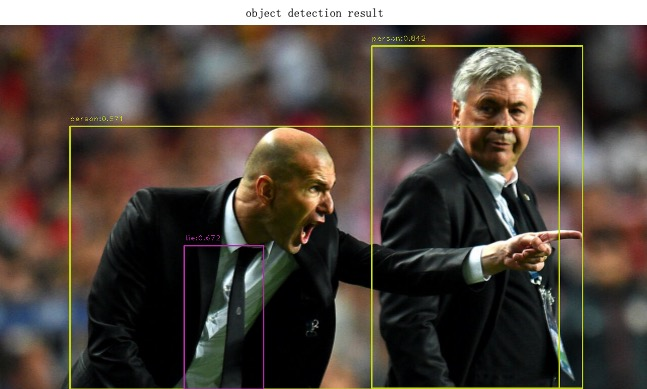

English | [简体中文](basic_tutorial_4.md)
# Basic Tutorial 4:model deployment based on TensorRT

This tutorial mainly introduces how to use the TensorRT as AdaFlow's plugin to build a pipeline, include [super resolution model](#super resolution model)、
[portrait segmentation model](#portrait segmentation model)、[object detection model](#object detection model).
These models have all been converted to ONNX.

## Create local folder as pipeline repository
Refer to Basic Tutorial 1 to create a new repository `onnx_model_repo`.

## <a id="super resolution model">super resolution model</a>
### Create `pipeline.json` for pipeline definitions

Then modify `onnx_model_repo/pipelines/SR/pipeline.json` with actual pipeline definition,

```
{
  "name": "SR",
  "description": "video super resolution based on TensorRT",
  "backend": "TensorRT",
  "dialect": "{{F.source('src1')}} ! videoconvert ! videoscale ! 
   video/x-raw,height=360,width=720,format=RGB ! flow_tensor_convert ! 
   flow_tensor_transform way=arithmetic option=div:255.0 ! 
   flow_tensor_transform way=dimchg option=nchw ! 
   flow_trtinfer onnx=./onnx_model_repo/resource/models/SR_sample.onnx trt=./onnx_model_repo/resource/models/SR_sample.trt sr=2 flexible=1 ! 
   flow_tensor_transform way=dimchg option=nhwc ! 
   flow_tensor_transform way=arithmetic option=mul:255.0 ! 
   flow_tensor_transform way=clamp option=0:255 ! flow_tensor_decode ! 
   videoconvert ! jpegenc ! {{F.sink('sink1')}}"
}
```

* `dialect` a specific description of pipeline processing, it can be described in double quotes like the basic tutorial 1/2 for a single node, or it can be described in double quotes like this tutorial, and the connection between nodes uses `! `.
    * `flow_tensor_convert` convert image/video frames to what is needed for inference-`tensor`data, default `float32`.
    * `flow_tensor_transform` `tensor` data processing, when `way=arithmetic`, include `add`-addition, `div`-division, `mul`-multiplication.
      when `way=dimchg`, data dimension transformation, arrangement can be set to `nchw` or `nhwc`. when `way=clamp`, data truncation, upper and lower limits can be set through `option`.
    * `flow_trtinfer` `AdaFlow` plugin for `TensorRT` inference backend. `onnx` specifies the address of the model, `trt` generates the address of `trt-model`, execute it once, if the `trt` model already exists, it will automatically skip `onnx to trt`,
      `sr` output image super-resolution multiple, whether `flexible` model is a variable `shape`.
    * `flow_tensor_decode` the `tensor` data is converted back into image/video frames.

### run pipeline
run pipeline:

```bash
adaflow launch onnx_model_repo SR --task_path ./onnx_model_repo/task/SR/task.json 
```

### pipeline result


## <a id="portrait segmentation model">portrait segmentation model</a>
### Create `pipeline.json` for pipeline definitions

Then modify `onnx_model_repo/pipelines/segment/pipeline.json` with actual pipeline definition,

```
{
  "name": "segment",
  "description": "human segment based on TensorRT",
  "backend": "TensorRT",
  "dialect": "{{F.source('src1')}} ! videoconvert ! videoscale ! 
  video/x-raw,width=320,height=176,format=RGB ! flow_tensor_convert ! 
  flow_tensor_transform way=dimchg option=nchw ! 
  flow_trtinfer onnx =./onnx_model_repo/resource/models/segment_sample.onnx trt=./onnx_model_repo/resource/models/segment_sample.trt ! 
  flow_tensor_transform way=arithmetic option=mul:255 ! flow_tensor_resize width=1024 height=576 ! 
  flow_tensor_decode ! videoconvert ! jpegenc ! {{F.sink('sink1')}}"
}
```

### run pipeline
run pipeline:

```bash
adaflow launch onnx_model_repo segment --task_path ./onnx_model_repo/task/segment/task.json 
```

### pipeline result


## <a id="object detection model">object detection model</a>
### Create `pipeline.json` for pipeline definitions


Then modify `onnx_model_repo/pipelines/detection/pipeline.json` with actual pipeline definition,

```
{
  "name": "object detection",
  "description": "object detection based on TensorRT",
  "backend": "TensorRT",
  "dialect": "{{F.source('src1')}} ! videoconvert ! videoscale ! 
  video/x-raw,width=640,height=640,format=RGB ! flow_tensor_convert ! 
  flow_tensor_transform way=arithmetic option=div:255.0 ! flow_tensor_transform way=dimchg option=nchw ! 
  flow_trtinfer onnx=./onnx_model_repo/resource/models/yolov8s.onnx trt=./onnx_model_repo/resource/models/yolov8s.trt input-name=input add-meta=true meta-key=det ! 
  flow_tensor_transform way=arithmetic option=mul:255.0 ! flow_tensor_transform way=dimchg option=nhwc ! 
  flow_tensor_resize width=1280 height=720 ! flow_tensor_decode ! 
  flow_python_extension module=./onnx_model_repo/extension/obj_detection_postprocess.py class= ObjDetPost function= postprocess ! 
  videoconvert ! jpegenc ! {{F.sink('sink1')}}"
}
```

* `dialect` a specific description of pipeline processing.
    * `flow_tensor_convert` convert image/video frames to what is needed for inference-`tensor`data, default `float32`.
    * `flow_trtinfer` `AdaFlow` plugin for `TensorRT` inference backend. `onnx` specifies the address of the model, `trt` generates the address of `trt-model`, execute it once, if the `trt` model already exists, it will automatically skip `onnx to trt`,
      `input-name` onnx model input name, default `input`, `add-meta` needs to save the inference result as `JSONMETA` attached to `GstBuffer`, it is recommended to use it on detection and recognition tasks.
      `meta-key` `JSONMETA` data key, the downstream plugins can obtain the inference result through the key.
    * `flow_python_extension` element provides a callback to execute user-defined Python functions on every frame in the
      adaflow pipeline, and can be used for metadata conversion, inference post-processing, and other tasks. `input`parameters of user-defined functions file path(such as yaml file),
      `module` Python module name, usually a python file path, `class`(optional) Python class name, `function` Python function name(Default, postprocess).

### Write extensions to complete your tasks
AdaFlow provides a plugin `flow_python_extension` to call user-defined post-processing functions. 
In this example, after the TensorRT model inference is completed, the detection results need to be displayed on the picture, 
and the extension is used to implement. The complete code is in onnx_model_repo/extension/obj_detection_postprocess.py

```bash
self.meta_data = frame.get_json_meta('det')
num_dets = self.meta_data['num_dets']
nums = num_dets[0][0]
scores = self.meta_data['scores'][0][:nums]
bboxes = self.meta_data['bboxes'][:nums]
labels = self.meta_data['labels'][0][:nums]
```

The core piece of code obtains the output of object detection `num_dets`, `scores`, `bboxes`, and `labels` respectively.

### run pipeline
run pipeline:

```bash
adaflow launch onnx_model_repo detection --task_path ./onnx_model_repo/task/detection/task.json 
```

### pipeline result


> **The end of chapter, thank you for reading**


