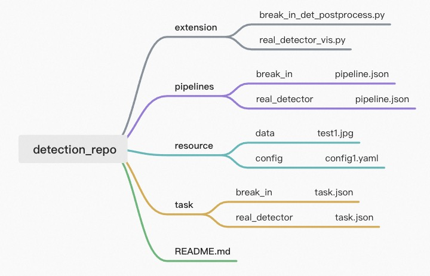

# AdaFlow Command Line Tool
## introduction
### run with exist Pipeline repositroy

```bash
python cli.py launch detection_repo break_in --task_path ./detection_repo/task/break_in/task.json 
```
or task with command input
```bash
python cli.py launch detection_repo break_in --task '{"sources": [{"name": "src1", "type": "file", "location": "./detection_repo/resource/data/test_walker1.jpeg"}], "sinks": [{ "name": "sink1", "type": "file", "location": "./detection_repo/resource/data/break_walk_res.jpg"}]}' 
```

### init new Pipeline repositroy
```bash
python cli.py init test_repo --task testone
```
